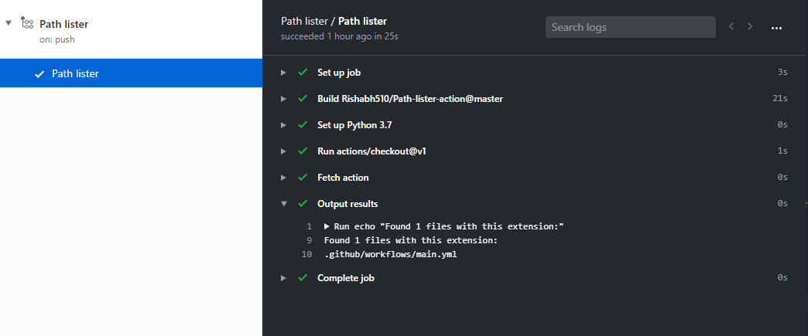

# Path lister action


A GitHub action to list path of all files with user specified extension in the folder/directory specified by the user on every push. Particularly useful for finding path of similar files in big projects.

## Inputs

| Input                                             | Description                                        |
|------------------------------------------------------|-----------------------------------------------|
| `path`(required)  | Path to find the files    |
| `type`(required)  | Type of files to find     |

## Outputs

| Output                                             | Description                                        |
|------------------------------------------------------|-----------------------------------------------|
| `path_count`  | Number of files found with the extension    |
| `paths`  | Path of all the files with the extension    |

## Example

```yaml
name: Path lister example
on: [push]
jobs:
  list:
    name: Path lister
    runs-on: ubuntu-latest
    steps:
      - name: Set up Python 3.7
        uses: actions/setup-python@v1
        with:
          python-version: "3.7"

      - uses: actions/checkout@v1

      - name: Fetch action
        id: pl
        uses: Rishabh510/Path-lister-action@master
        with:
          path: ".github/"
          type: ".yml"

      - name: Output results
        run: |
          echo "Found ${{ steps.pl.outputs.path_count }} file(s) with this extension:"
          for i in ${{ steps.pl.outputs.paths }}; do
          echo $i
          done
```
>Output generated for the above yaml file:



## License 
[MIT license]

[MIT license]: LICENSE
